# Лабораторная работа № 4 по дисциплине "Тестирование программного обеспечения"

## Задание

С помощью программного пакета Apache JMeter провести нагрузочное и стресс-тестирование веб-приложения в соответствии с вариантом задания.

В ходе нагрузочного тестирования необходимо протестировать 3 конфигурации аппаратного обеспечения и выбрать среди них наиболее дешёвую, удовлетворяющую требованиям по максимальному времени отклика приложения при заданной нагрузке (в соответствии с вариантом).

В ходе стресс-тестирования необходимо определить, при какой нагрузке выбранная на предыдущем шаге конфигурация перестаёт удовлетворять требованиям по максимальному времени отклика. Для этого необходимо построить график зависимости времени отклика приложения от нагрузки.

- Приложение для тестирования доступно только во внутренней сети кафедры.
- Если запрос содержит некорректные параметры, сервер возвращает HTTP 403.
- Если приложение не справляется с нагрузкой, сервер возвращает HTTP 503.

Параметры тестируемого веб-приложения:
- URL первой конфигурации ($ 2700) - http://aqua:8080?token=466636634&user=1964513632&conf=1;
- URL второй конфигурации ($ 3800) - http://aqua:8080?token=466636634&user=1964513632&conf=2;
- URL третьей конфигурации ($ 7500) - http://aqua:8080?token=466636634&user=1964513632&conf=3;
- Максимальное количество параллельных пользователей - 5;
- Средняя нагрузка, формируемая одним пользователем - 20 запр. в мин.;
- Максимально допустимое время обработки запроса - 720 мс.

Отчёт по работе должен содержать:
- Текст задания.
- Описание конфигурации JMeter для нагрузочного тестирования.
- Графики пропускной способности приложения, полученные в ходе нагрузочного тестирования.
- Выводы по выбранной конфигурации аппаратного обеспечения.
- Описание конфигурации JMeter для стресс-тестирования.
- График изменения времени отклика от нагрузки для выбранной конфигурации, полученный в ходе стресс-тестирования системы.
- Выводы по работе.

## Выполнение

При нагрузочном тестрировании определяем удовлетворяемость требованиям по максимальному времени отклика приложения при нагрузке в 5 пользователей в течение 1 минуты (20 запросов\мин от 1 пользователя).

При стресс-тестировании определяем предельные нагрузки, при которых приложение:
- удовлетворяет требованиям по максимальному времени отклика (720 мс);
- возвращает корректные ответы на запросы (статус 200).

## Нагрузочное тестрирование

### Конфигурация JMeter:

Test plan:


Thread Goup:

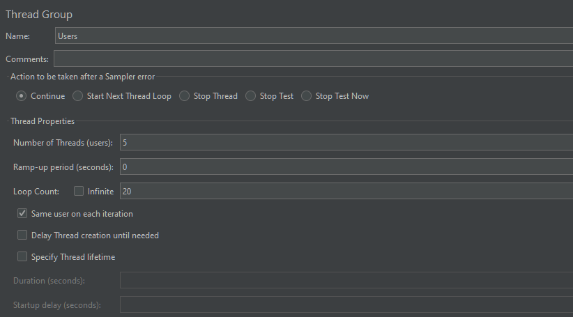

HTTP Request:

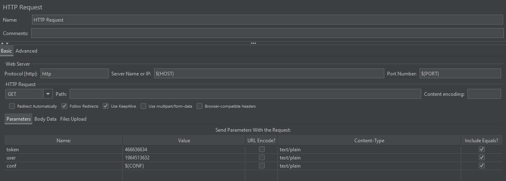

Duration Assertion:

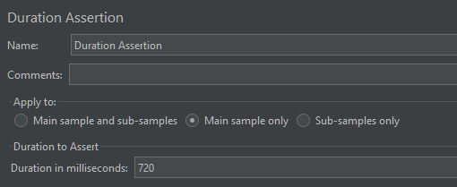

Timer:

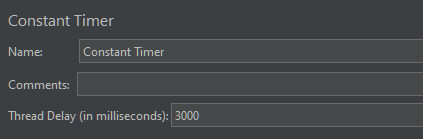

### Конфигурация 1:

Удовлетворяет требованиям по времени отклика при максимальном количестве параллельных пользователей (5).

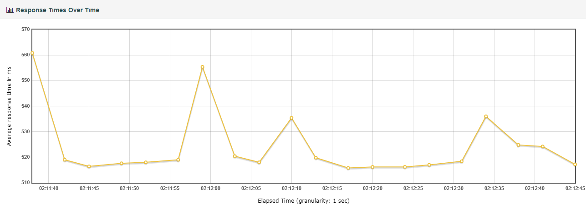

### Конфигурация 2:

Удовлетворяет требованиям по времени отклика при максимальном количестве параллельных пользователей (5).

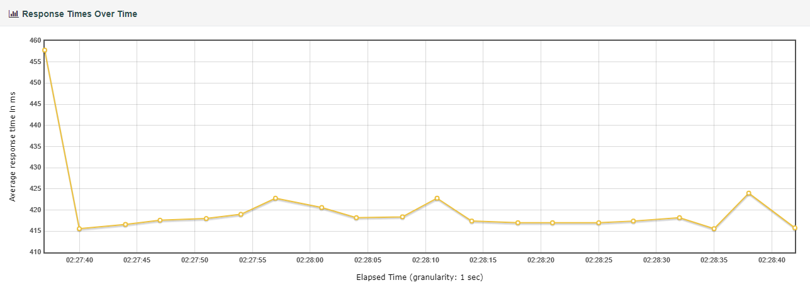

### Конфигурация 3:

Удовлетворяет требованиям по времени отклика при максимальном количестве параллельных пользователей (5).


В результате нагрузочного тестирования было определено, что самой дешевой конфигурацией, удовлетворяющей требованиям по времени отклика, является конфигурация 1 ($ 2700). 

## Стресс-тестрирование

### Конфигурация JMeter:

Test plan:

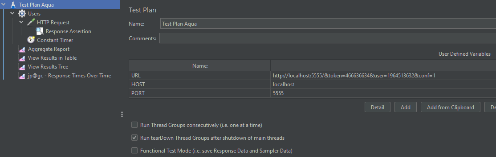

Thread Goup:

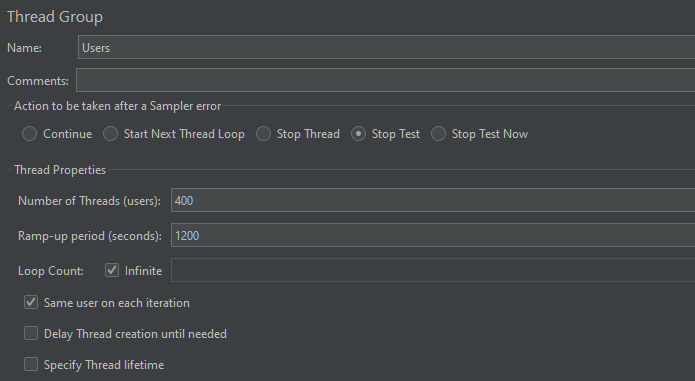

Response Assertion:

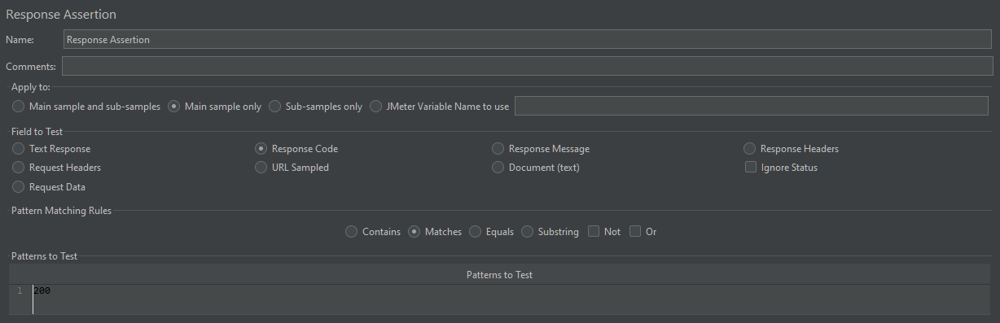

### Результаты стресс-тестирования 

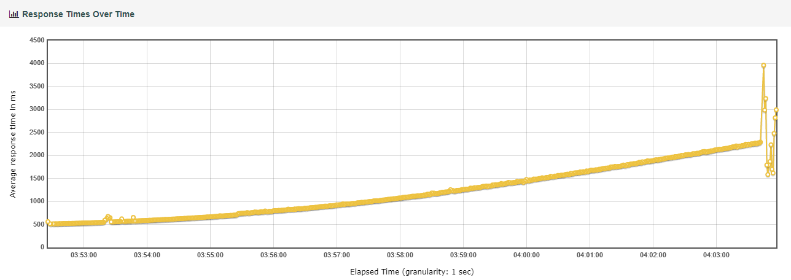
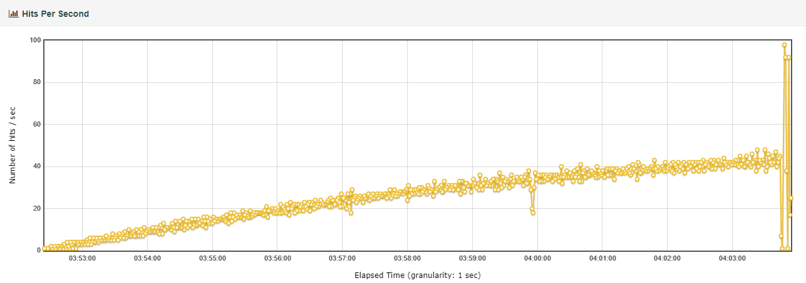

В результате стресс-тестирования для конфигурации 1 определено:
1. Сервер перестает отвечать требованияим по времени отлика при 63 пользователях. До превышения максимальной задержки имеет предельные показатели:
    ```
    load:  17.00 hits/s
    response time:  708 ms
    ```
2. При постепенном наращивании нагрузки возвращает ответ со статусом 503 при 230 пользователях. До отказа сервера имеет предельные показатели:
    ```
    load:  45.00 hits/s
    response time:  2292 ms
    max response time:  3056 ms
    ```

## Вывод

В ходе выполнения лабораторной работы было проведено нагрузочное тестирование для приложений 3-х различных конфигураций при помощи программного пакета Apache JMeter. В результате была выявлена конфигурация, которая удовлетворяет предоставленным требованиям и проведено стресс-тестирование для этой конфигурации, в ходе чего было определена ее максимальная пропускная способность.
